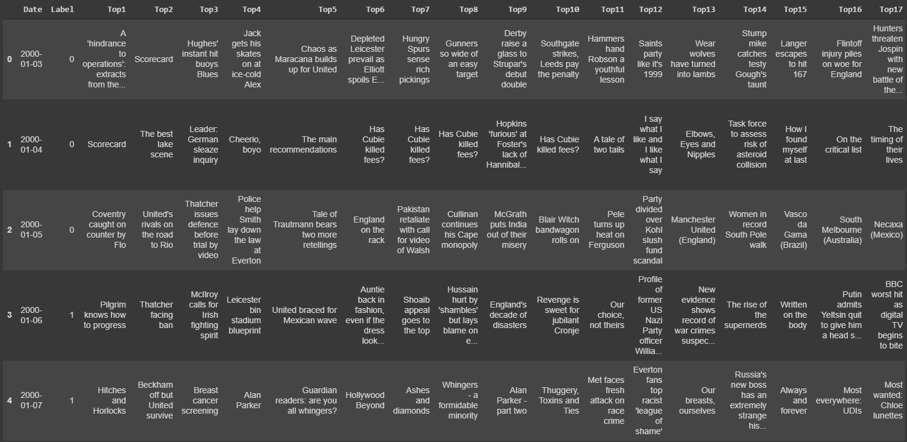
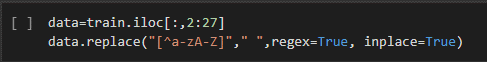
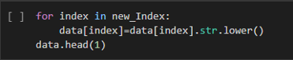
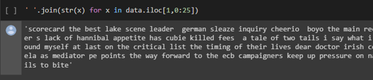
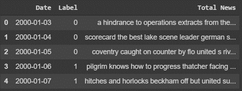

# Columbia Fintech Bootcamp - Project 2
*Assignment - Use Jupyter, Google Colab, or AWS SageMaker to prepare a training and testing dataset and train a machine-learning model.*

# Using Daily News Headlines to Predict the Direction of the Dow Jones Industrial Average

## Team Members:
- David Still
- Charles Xia
- Ian Walter

# Topic of the Analysis:
Can we accurately predict the direction of the Dow Jones Industrial Average (DJIA) by analyzing the news sentiment? 

# Hypothesis
News headlines drive the near-term performance of the stock market. By analyzing major news headlines around the world on any given day, we should be able to predict the direction of the stock market on that day. 

# How We Performed the Analysis
Data was provided by Kaggle. The dataset contains 27 total columns:

- Column 1: Date
- Column 2: Performance of the DJIA. Up days represented as '0' on a down day and '1' on an up day.
- Columns 3-27: Top 25 news headlines. The top 25 news headlines were sourced from the Reddit WorldNews Channel and voted on by Reddit users. 

# Model Summary
We evaulated two different machine learning models: 

1. LSTM RNN using the the Keras Tokenizer class to vectorize the text

2. Random Forest using Scikit-learn's CountVectorizer class to represent text as bigrams (n=2) 

Reason why used these two models...

# Data Cleanup & Exploration
The most difficult part of the project was finding a good dataset. Initially we wanted to pull in news articles from an API but most of the popular, free APIs (News Api, Stock News API, Yahoo Finance API powered by Rapid API etc.) had limitations with how much data you could pull or how many API calls you were allowed to perform. We also tried to learn how to scrape the web to pull data from SeekingAlpha but the site prohibits news scraping (HTTP error 403). 

# Initial DataFrame Before PreProcessing

# Data Cleanup

The headlines contained punctuation and had to be cleaned up in order to do the analysis. We converted all the headlines to regular expressions:

We then converted all of the cells to lowercase strings so the text would be treated equally when implementing the bag of words for the Random Forest Model:

We then joined all the news sources across all the rows to form one giant string:

Lastly we created a new DataFrame with a "Total News" column that made it possible to perform the analysis:

# LSTM Models
We ran two LSTM models and varied some of inputs. 

Model 1 had 280 units and 50 epochs: 

## Define the First LSTM RNN model
model_lstm = Sequential()
### Layer 1
model_lstm.add(Embedding(vocabulary_size, embedding_size, input_length=max_words))
### Layer 2
model_lstm.add(LSTM(units=280))
# Output layer
model_lstm.add(Dense(1, activation="sigmoid"))

Model 2 had 50 units and 30 epochs. We also added a 20% dropout rate:

## Define the Second LSTM RNN model
model_lstm_2 = Sequential()
dropout_fraction = 0.2
### Layer 1
model_lstm_2.add(Embedding(vocabulary_size, embedding_size, input_length=max_words))
model_lstm_2.add(Dropout(dropout_fraction))
### Layer 2
model_lstm_2.add(LSTM(units=50))
model_lstm_2.add(Dropout(dropout_fraction))
### Output layer
model_lstm_2.add(Dense(1, activation="sigmoid"))

URL for Google CoLab: https://colab.research.google.com/drive/1Z8Sg5yBEaz8Z3iidxGxoqjKTyG0HBPmv?usp=sharing
URL for Presentation: https://docs.google.com/presentation/d/1OZdSwFY6oAaGBmVpiXtSWOTG1iQGQKcTEvzLdvL_t8I/edit?usp=sharing

## Project Proposal
This project is to utilize news sentiment to predict stock movement. The use of Natural Language Processing (NLP) will generate positive sentiment of news gathered from Reddit's Top 25 headlines. Machine learning models will be run to see if we can predict future good or bad days of the Dow Jones Industrial Average (DJIA). We will be sourcing our data from the a Kaggle dataset and Yahoo Finance.

## Data/Apis Used
- Kaggle DJIA Dataset

## Machine Learning Models Used
- Random Forest
- LSTM RNN

## Technologies Used
- Google Colab
- Pandas
- Numpy
- Matplotlib

