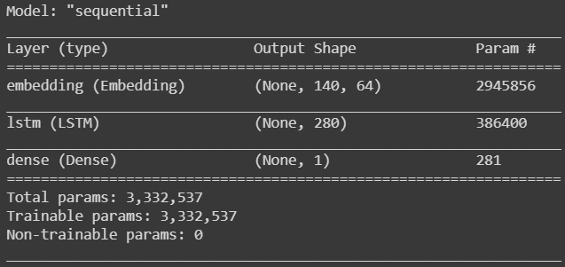
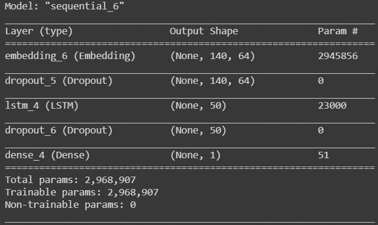
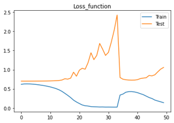
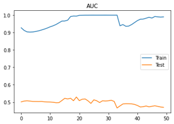
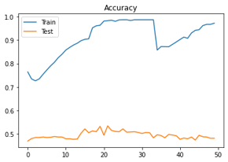
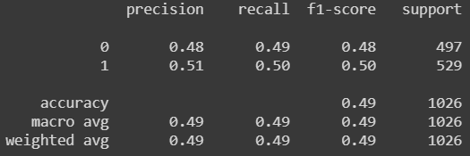
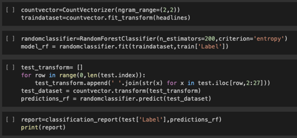
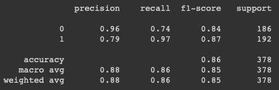

# Columbia Fintech Bootcamp - Project 2
*Assignment - Use Jupyter, Google Colab, or AWS SageMaker to prepare a training and testing dataset and train a machine-learning model.*

# Using Daily News Headlines to Predict the Direction of the Dow Jones Industrial Average

## Team Members:
- David Still
- Charles Xia
- Ian Walter

# Topic of the Analysis:
Can we accurately predict the direction of the Dow Jones Industrial Average (DJIA) by analyzing the news sentiment? 

# Hypothesis
News headlines drive the near-term performance of the stock market. By analyzing major news headlines around the world on any given day, we should be able to predict the direction of the stock market on that day. 

# How We Performed the Analysis
Data was provided by Kaggle. The dataset contained 27 total columns:

- Column 1: Date
- Column 2: Performance of the DJIA. Up days represented as '0' on a down day and '1' on an up day.
- Columns 3-27: Top 25 news headlines. The top 25 news headlines were sourced from the Reddit WorldNews Channel and voted on by Reddit users. 

# Putting Kaggle dataset into a DataFrame

# Model Summary
We evaulated two different machine learning models: 

1. LSTM RNN using the the Keras Tokenizer class to vectorize the text

2. Random Forest using Scikit-learn's CountVectorizer class to represent text as bigrams (n=2) 

# Reason why used these two models...

# Data Cleanup & Exploration
The most difficult part of the project was finding a good dataset. Initially we wanted to pull in news articles from an API but most of the popular, free APIs (News Api, Stock News API, Yahoo Finance API powered by Rapid API etc.) had limitations with how much data you could pull or how many API calls you were allowed to perform. We also tried to learn how to scrape the web to pull data from SeekingAlpha but the site prohibits news scraping (HTTP error 403). 

# Data Cleanup

The headlines contained punctuation and had to be cleaned up in order to do the analysis. We converted all the headlines to regular expressions:

We then converted all of the cells to lowercase strings so the text would be treated equally when implementing the bag of words for the Random Forest Model:

We then joined all the news sources across all the rows to form one giant string:

Lastly we created a new DataFrame with a "Total News" column that made it possible to perform the analysis:

# LSTM Models
We ran two LSTM models and varied some of inputs. 

Model 1 had 280 units and 50 epochs: 

Model 2 had 50 units and 30 epochs. We also added a 20% dropout rate:

# LSTM Model 1 Evaluation

# LSTM Model 2 Evaluation

# Random Forest Model Evaluation:

- The model has an accuracy of 86% lending it to work better than the LSTM models
- If timed allowed, we would have run additional variances of the classifier to see how it would affect the model overall

# Discussion
It was interesting to see that the two models performed so differently. We assumed LSTM model would perform better because we could adjust the number of hidden layers and add a dropout rate.  
The LSTM model performed poorly. We ran two models and varied them by changing the number of epochs and units, while one model had a dropout rate of 0.2 and the other did not have one. The  two models had accuracy scores of 0.50 and 0.49 respectively. Both of the models had overfitting; the training data set performed well but the testing dataset did not perform well.  In one of the LSTM models the loss per iteration increased over time. 
The Random Forest using a bag of words performed markedly better than the LSTM model using sentiment analysis. The Random Forest model had an accuracy score of 0.86, indicating that we were able to predict the direction of the DJIA 86% of the time. 

# Post Mortem
The most difficult part of the project was finding a good dataset. Initially we wanted to pull in news articles from an API but most of the popular, free APIs (News Api, Stock News API, Yahoo Finance API powered by Rapid API etc.) had limitations with how much data you could pull or how many API calls you were allowed to make. We also tried to scrape the web to pull data from SeekingAlpha but the site prohibits news scraping (HTTP error 403). 
Given tokenization and vectorization only categorize language, had we have more time we would have implemented a sentiment analysis such as vader to provide additional context to our model for machine learning. 
If we had been able to pull in real time news data from an API, we would have liked to feed it into one of our models to run an algo trading platform and see how it actually performed. It would also be interesting to see if we could build a model that predicted the actual return of the market versus just the directionality of the market.

URL for Google CoLab: https://colab.research.google.com/drive/1Z8Sg5yBEaz8Z3iidxGxoqjKTyG0HBPmv?usp=sharing
URL for Presentation: https://docs.google.com/presentation/d/1OZdSwFY6oAaGBmVpiXtSWOTG1iQGQKcTEvzLdvL_t8I/edit?usp=sharing

## Project Proposal
This project is to utilize news sentiment to predict stock movement. The use of Natural Language Processing (NLP) will generate positive sentiment of news gathered from Reddit's Top 25 headlines. Machine learning models will be run to see if we can predict future good or bad days of the Dow Jones Industrial Average (DJIA). We will be sourcing our data from the a Kaggle dataset and Yahoo Finance.

## Data/Apis Used
- Kaggle DJIA Dataset

## Machine Learning Models Used
- Random Forest
- LSTM RNN

## Technologies Used
- Google Colab
- Pandas
- Numpy
- Matplotlib

